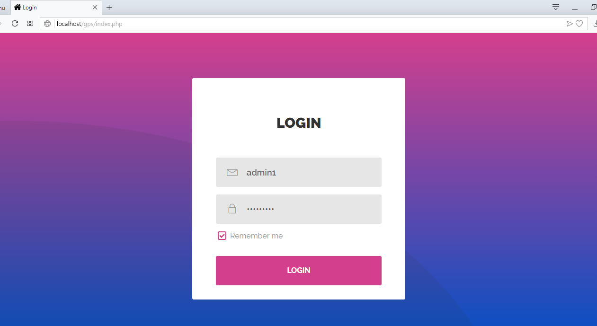

# Visitor's Pass Generation System

It is a web based project which I made for Grafest 2018 Technical Event WEB-O-PEDIA.This project was developed for gate keepers to generate the entry passes for visitors of university.

<h1>LOGIN</h1>

**username-Admin1** 
**password-admin@123** 
------------------------------------- 
**username-Admin2**  
**password-admin@2**
 -------------------------------------

 
<h1>Registration</h1>
<ul>
  <li>Enter the valid details and upload the photo in order to activate the pass generation link.</li>
 </ul>

<ul>
  <li>Photo extension must be in .jpg or .jpeg format.</li>
</ul>

<ul>
  <li>Click on the pass generation link to generate visitor's pass</li>
</ul>

<h1>Visitor's Pass </h1>

<ul>
  <li>This is the Bulma's pass who wants to visit GEU University </li>
</ul>

<h1>Enteries</h1>

<ul>
  <li>Gate keepers can check the details of visitor using this module</li>
</ul>

<h1>Run Config</h1>

[Click on the link](https://github.com/mohit1018102/Minor_Project/blob/master/Visitor's%20Pass%20Generation%20System/run)

